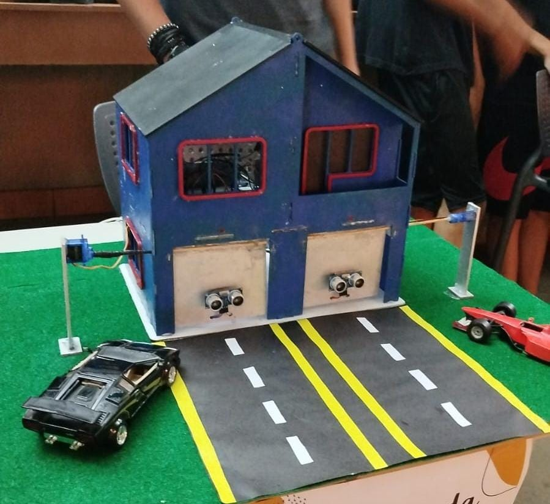
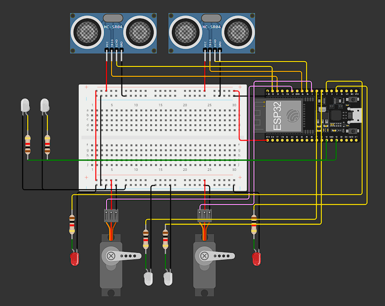
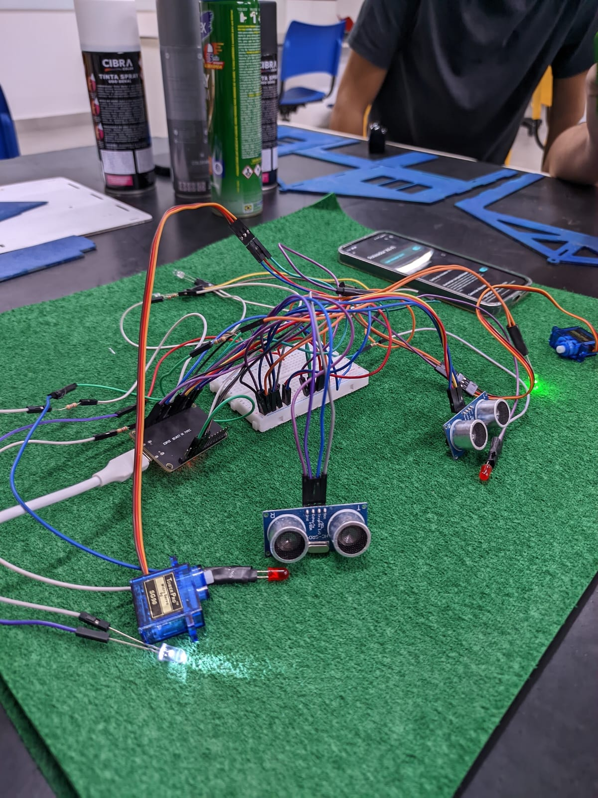

<h1 align="center"> Projeto Casa Automatizada IOT </h1>

Projeto com foco em automação, sistemas embarcados e circuitos físicos 

  

## 🚀 Tecnologias

Esse projeto foi desenvolvido com as seguintes tecnologias:

- C++
- Arduino IDE
- Bibliotecas: ESPAsyncWebServer, WiFi, ESP32Servo
- HTML e CSS
- Visual Studio Code

## 💻 Projeto

Este projeto utiliza a placa ESP32 para controlar dois servomotores e seis LEDs por meio de comandos via monitor serial, site e sensores independentes de comando. Além disso, sensores ultrassônicos são empregados para detectar a proximidade de objetos e acionar automaticamente os servomotores, abrindo e fechando as "garagens".

As funcionalidades principais incluem a possibilidade de ligar e desligar diferentes conjuntos de LEDs, assim como controlar a rotação dos servomotores manualmente ou com base na distância detectada pelos sensores. O sistema também permite o gerenciamento de tempo para o acionamento dos servos e o estado de funcionamento dos LEDs, tornando o controle eficiente e automatizado.

O código foi desenvolvido para ser simples e modular, permitindo a fácil integração com outros sistemas e a expansão de funcionalidades no futuro.

## 🧵 Modelo de ligação

  

  

